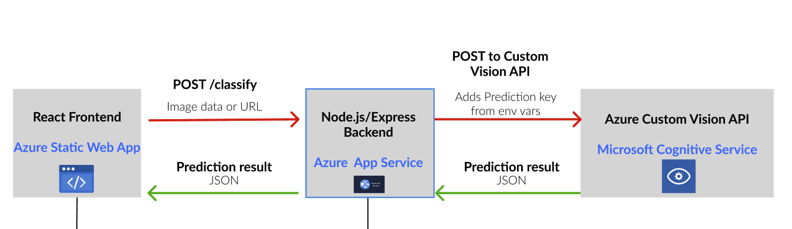

# Tina Bot Car Classifier Backend

This is the Node.js/Express backend for the Tina Bot Car Classifier project.
It acts as a secure proxy between the frontend and Azure Custom Vision, keeping API keys safe.

---

## Features

- Receives image files or URLs from the frontend
- Forwards requests to Azure Custom Vision API
- Returns classification results to the frontend
- Keeps Azure Prediction Key and endpoint secure (never exposed to frontend)

---

## System Architecture



---

## Getting Started

> **Note:**  
> This is the backend for Tina Bot Car Classifier.  
> To use the full application, you will also need the [frontend repository](https://github.com/AndyGuffey/mission-01).

> **You must have your own Azure Custom Vision Prediction Endpoint and Prediction Key to run this backend.**

---

### 1. Clone the repo

```sh
git clone https://github.com/AndyGuffey/mission01-backend.git
cd mission01-backend
```

### 2. Set up environment var

- Copy `.env.example` to `.env`
- Fill in your Azure Custom Vision Prediction Endpoint and Prediction Key

### 3. Install dependencies

```sh
npm install
```

### 4. Run the backend locally

```sh
node index.js
```

The server will start on `http://localhost:4000` by default.

---

## Deployment

- Deploy to Azure App Service.
- Set the environment variables (`CUSTOM_VISION_BASE_ENDPOINT` and `CUSTOM_VISION_PREDICTION_KEY`) in Azure cloud provider's configuration.

---

## Security

- **Never** commit your real `.env` file or secrets to version control.
- Use `.env.example` to show required variables.

---
